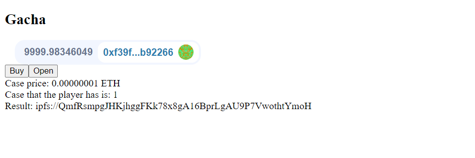
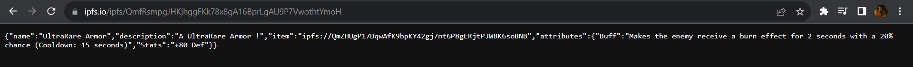
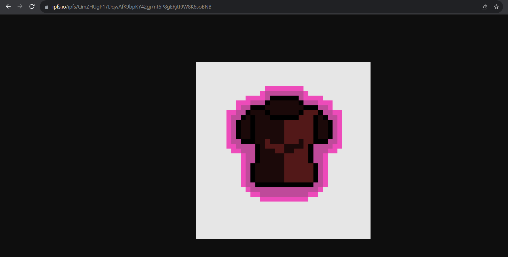

# Gacha App

Implementation of a gacha smart contract (obtaining item image with a certain probability) using chainlink VRF.

## Requirement
Before running the command below, make sure that you have installed metamask and ipfs extension.

## Quickstart
```
git clone https://github.com/Yehezkiel-simbuang/Gacha-App
cd Gacha-App/
yarn
yarn hardhat node
```
After running the command above, copy one of the private keys and import it to metamask. And after that,
open new terminal, and run the command below
```
cd app/
yarn
yarn run dev
```
## Web




I will update the UI soon :)

# Note

The web runs using a hardhat network.
